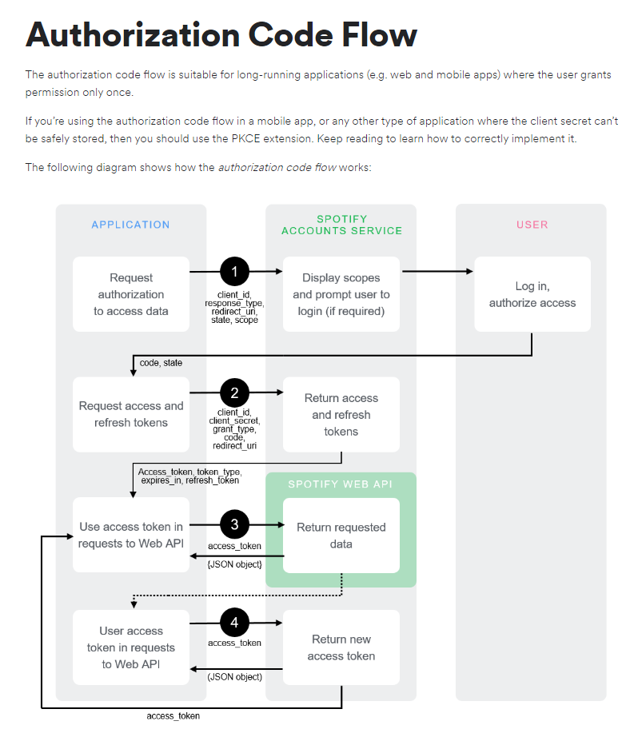

# Runify

## Push your running pace with the power of music

This app helps you easily create playlists at a desired BPM to match your cadence. Playlists can be created by selecting the desired BPM and then selecting songs or artists to use as _seeds_ for the playlist. Runify uses Spotify's tremendous recommendation algorithm to create a playlist that can be added to your library with the click of a button.

## Usage

Login, select your desired BPM, songs/artists to use as seeds and generate a playlist!

## Login With Spotify

Runify uses Spotify's authorization code flow so we never have access to your Spotify credential. Simply log in through Spotify and you will be redirected back to our webpage with a token that expires in 60 minutes.

